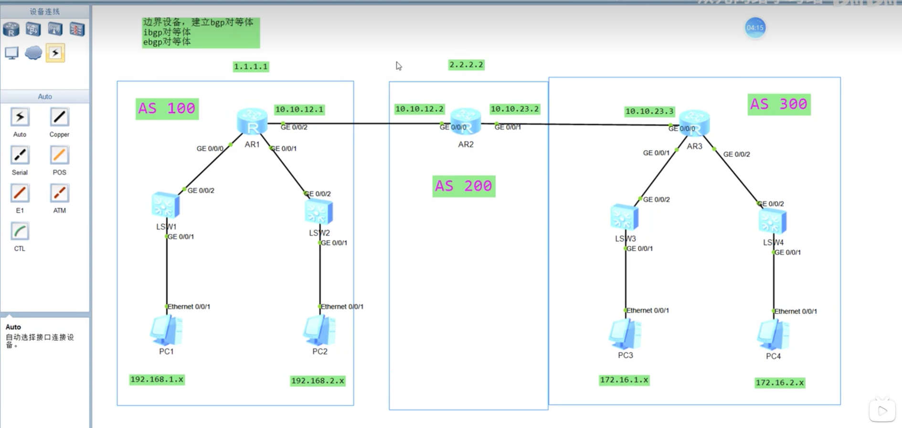

## BGP

### 介绍

边界网关协议BGP（Border Gateway Protocol）是一种实现自治系统AS（Autonomous System）之间的路由协议，它会检测路由回路并根据性能优先和策略约束对路由进行决策，可以跨越多跳路由器建立邻居关系。

外部网关协议，用于不同自治系统(AS)之间，寻找最佳路由。

### 特点

TCP 179端口，支持VLSM和CIDR。

路径矢量协议，可以检测环路。

### BGP防环措施

* AS_Path，AS之间
  * BGP路由会记录经过的AS号码，简称AS_Path。如果BGP收到路由的AS_Path中包含自己的AS号码，就认为出现了路由环路，从而丢弃收到的路由。
* IBGP水平分割
* (TODO)
* (TODO)

### BGP路由产生方式

优先级：手动聚合 > 自动聚合 > network > import

### BGP四个报文

* Open 建立邻居关系
* Update 发送新的路由信息
* Keepalive 周期性确认邻居关系，60s keep alive，180 ttl
* Notifiation 报告检测到的错误

### BGP选路规则

1. 丢弃下一跳不可达的路由
2. 优选Preference Value最高的路由
3. 优选Local Value最高的路由
4. 优选手动聚合 > 自动聚合 > network > import > 从对等体学到的
5. 优选AS_Path最短的路由
6. 起源类型IGP > EGP > Incomplete
7. 对于同一AS的路由，优选MED最小的
8. EBGP > IBGP
9. 优选AS内部IGP的metric最小的路由

### 公认必遵

Origin, AS_Path, Next_hop

AS_Path作用：防止环路，用来选路。

## AS(自治系统)

AS（Autonomous System），自治系统，是由单一的机构或组织所管理的一系列IP网络及设备所构成集合。

划分AS的原因：1.整个地球上的网络范围太大，单个网络收敛很慢且网络延迟大；2.每个网络可能是某个组织或公司组建的。

为了方便对自治系统进行管理，给每一个自治系统设计了一个号，即AS号。AS号由16位二进制构成，取值范围：0～65535，其中1～64511号为公有AS号， 64512～65534被设定为私有AS号。

因为传统的AS号存在不够用的情况，所以目前大部分设备均支持拓展的AS号，由32位二进制构成。

### 类型

运行在相同AS之间的BGP路由器建立的邻居关系为IBGP（Internal BGP）邻居关系。

运行在不同AS之间的BGP路由器建立的邻居关系为EBGP（External BGP）邻居关系。

两个设备在同一个AS：IBGP对等体，不同AS: EBGP对等体。

### BGP最优路由决策策略

一台路由器有可能学习到多条去往相同目的网络的BGP路由，BGP会在这些路由中选择一条最优的路由。BGP定义了一整套详细的选路规则，使得路由器能够在任何复杂的、冗余的网络环境下，决策出一条最优的路由。


同时也可以针对特定的路由设置Preferred_Value。


#### 1.优选具有最大Preferred_Value的路由

当路由器学习到多条到达同一个目的网络的BGP路由时，拥有最大Preferred_Value值的路由将会被优选。

#### 4.优选AS_PATH最短的路由

当路由器学习到多条到达同一个目的网络的BGP路由时，如果路由的Preferred_Value属性值、Local_Preference属性值都相等，并且这些路由都是学习自其它邻居的，那么AS_PATH最短的路由将被优选。

### TTL防环

数据包中的一个数值，每次到达一台设备时就减去1，直到减到0时丢弃。

### 配置&实验



#### 第一步：给每台设备配置router id

通常用loopback来配置
```
int loop 1
ip add 1.1.1.1 32
```

#### 第二步：开启BGP，设置这台设备的AS
```
bgp 100
```

#### 第三步：配置BGP对等体，前提条件：两个设备tcp能握手，设置ttl
```
(bgp 100)
peer 2.2.2.2 as 200
```
```
(bgp 200)
peer 1.1.1.1 as 100
peer 3.3.3.3 as 300
```
确认步骤
```
(sysname AR1)
dis bgp peer (只有状态为Established才是成功建立，其余状态如idle/active/connect均代表有故障)
ping -a 1.1.1.1 2.2.2.2
dis ip routing-table 2.2.2.2 (查看相关路由表)
ip route-static 2.2.2.2 32 10.10.12.2

(AR2)
ip route-static 1.1.1.1 32 10.10.12.1
```
设置ttl步骤
```
(AR1)
bgp 100
peer 2.2.2.2 connect-interface LoopBack 1
peer 2.2.2.2 ebgp-max-hop 10
```

#### 第四步：把IGP路由引入BGP

方法一：network引入路由，人工指定。
```
(AR3)
bgp 300
network 172.16.1.0 24
(把172.16.1.0/24放入AR3 bgp路由中，AR2从AR3中学到此路由，然后自动再发给它的邻居AR1)
```

```
(AR1)
bgp 100
network 192.168.1.0 24
(撤销命令: undo network 192.168.1.0 24)
```

方法二：import引入路由

```
import ospf // 把ospf协议产生的路由全部放入bgp里
```

```
(AR3)
bgp 300
import-route direct

(AR1)
bgp 100
import-route direct
```

### 资料来源

[1] https://cloud.tencent.com/developer/article/2230868
