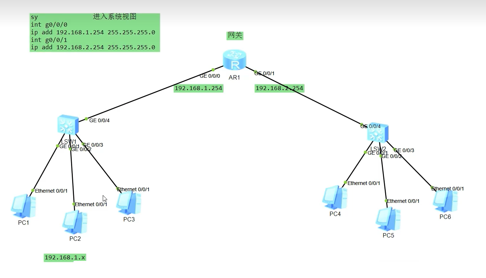

# 基础知识

## 术语

封装：对数据载荷添加头部和尾部，形成新的报文的过程。

路由器：为报文选择传递路径的网络设备。

网关：提供协议转换，路由选择，数据交换等功能的网络设备。

局域网（LAN，Local Area Network），在某一地理区域内由计算机，服务器以及各种网络设备组成的网络，即范围较小的计算机网络。

城域网 (MAN，Metropolitan Area Network)，在一个城市范围内所建立的计算机通信网络。

广域网（WAN，Wide Area Network），覆盖很大的地理范围，能连接多个城市甚至国家，典型的广域网：Internet（因特网）/ 大型公司办公专网。

因特网（Internet），由全球所有的网络所组成的集合，也就是由无数个局域网，通过WAN线路汇聚到运营商，然后运营商之间互联起来，所形成的互联网。

网络拓扑（Network Topology）是指用传输介质（例如双绞线，光纤等）互联各种设备（例如计算机终端，路由器，交换机）所呈现的结构化布局，用于描述网络的物理或逻辑结构。

## 基础知识

### 三次握手
```
TCP三次握手：客户端和服务器
-> [SYN J]
<- [ACK J+1, SYN K]
-> [ACK K+1]
```
### 四次握手

```
-> [FIN X]
<- [ACK X+1]
需要等待服务器发完剩余的数据
<- [FIN Y]
-> [ACK Y+1]
```

### TCP UDP

基于 TCP 的协议（面向连接，可靠传输）
```
HTTP（80端口）超文本传输协议，用于网页浏览（如 http://）。
HTTPS（443端口）加密的 HTTP，使用 TLS/SSL 加密（如 https://）。
FTP（20/21端口）文件传输协议，用于文件上传/下载（数据端口 20，控制端口 21）。
SSH（22端口）安全外壳协议，用于加密的远程登录和管理。
BGP (179端口) 边际网关协议
```

基于 UDP 的协议（无连接，高效但不可靠）
```
TFTP（69 端口）简单文件传输协议，设计用于在客户端和服务器之间进行简单且低开销的文件传输。
SNMP（161/162 端口）（简单网络管理协议）默认使用两个UDP端口：161端口用于接收SNMP管理请求（如Get, Set），162端口用于发送SNMP陷阱（Traps）和通知（Informs）。
DNS（53 端口）域名解析协议（通常使用 UDP，但某些情况下会回退到 TCP）。
DHCP（67/68 端口）动态主机配置协议，自动分配 IP 地址。
```
关键区别:

TCP：面向连接、`可靠有序`、流量控制（适合文件传输、网页、邮件）。

UDP：无连接、要求`低延迟`、高效但不可靠，可以`接受丢包`（适合实时应用如视频、DNS查询）。

举例：网络游戏，刚登陆游戏、下载文件、客户端更新，希望文件完整性，用TCP。团战开始，对延迟非常敏感，用UDP。

### 端口号

客服端软件:端口号  < >  服务器端软件:端口号

E.g, TCP 192.168.0.17:8858  52:113:196:254:443

## 网络设备

### 交换机

距离终端用户最近的设备，用于接入网络，对数据帧进行交换等。接入层的交换机一般为二层交换机，又称以太网交换机。二层是指以TCP/IP参考模型的数据链路层。

例如：连接不同的电脑，组建局域网。

工作原理：基于源MAC地址，学习构建MAC地址表，基于目的MAC地址进行转发。

解决MAC-flood方法：静态绑定，端口安全

### 路由器 Router

主要作用：实现不同网络之间的通信，例如放在内网和外网之间。

网络层设备。根据所收到报文的目的地地址选择一条合适的路径，将报文传送到下一个路由器或目的地。

根据数据包IP头部中的目的IP地址，在路由表中进行查找。最长子网掩码匹配。

适用用场景：

* 同类型网络或异种网络之间的通信
* 隔离广播域
* 维护路由表，运行路由协议
* 路径选择，IP报文转发
* 广域网接入，网络地址转换
* 连接通过交换机组建的二层网络



### 防火墙

网络安全设备，用于控制两个信任度不同的网络之间的安全通信。

阻止：从外内到的攻击，从内到外的非法网站访问。

### 无线设备

AC (Access Controller)，即无线控制器，是企业级无线网络（WLAN）中的核心设备，是用来集中控制、管理和监控所有 Fit AP （瘦AP）的网络设备。

## 网络参考模型

OSI (Open Systems Interconnection Model) 七层模型

程序开发的应用层：
* 7 应用层 - 对应用程序提供接口
* 6 表示层 - 进行数据格式的转换
* 5 会话层 - 两个程序之间的对接，例如：客户端和服务器端

* 4 传输层 - 决定传输使用TCP或者UDP，给数据包加上端口号。
* 3 网络层 - IP头部封装，根据路由表进行转发。
* 2 数据链路层 - 基于MAC地址进行通信。例如交换机有电脑的MAC地址表。
* 1 物理层 - 信号传输物理介质，网线/光纤/无线。

### 常见网络层协议

ICMP（互联网控制消息协议）是一种网络层协议，用于在主机和路由器之间传递控制和错误消息，以帮助诊断网络问题、测试连通性和报告网络中的错误。它主要功能包括检测网络故障/测试网络质量。它最常用于`ping`和`traceroute`命令。

* ping 命令通过向目标设备发送 ICMP 回显请求数据包来测试网络设备的可访问性。如果设备可以访问，则会返回 ICMP 回显回复。它可以可靠地检查网络延迟并确保设备可用。
* traceroute 命令跟踪数据包从源到目的地所采用的路径。为此，该命令将回显请求和回显回复消息发送到预定目的地。

IGMP (互联网组管理协议) 是一种用于管理IP 组播组成员关系的协议。

### 数据链路层协议

Ethernet 以太网协议。

PPP协议，点到点协议（Point to Point Protocol，PPP）是为在同等单元之间传输数据包这样的简单链路设计的链路层协议。

PPPoE协议（Point-to-Point Protocol over Ethernet）是一种在以太网上运行的点对点协议，它将PPP协议封装在以太网帧中，主要用于宽带接入。路由器<>运营商设备的`点到点`上网，和其他线路隔离，常用于宽带拨号。

## 三张表

路由表，MAC地址表，ARP表。

### 路由表的安全

* 认证
* 静默接口
* GTSM(通用TTL安全保护机制)

```
ospf valid-ttl-hops 2 #TTL有效范围254-255
```

### ARP协议工作流程

1. 主机A查询自己的ARP缓存，发现没有主机B对应的MAC地址。
2. 主机A发送ARP Request广播报文
3. 主机B把主机A

### 工作原理

建立并维护路由表RIB，根据路由表进行数据转发。

### 优先级

路由优先级用于区分不同路由协议的优先级，取值0-255，越小越优先。

直连设备 0

OSPF 10

IS-IS 15

静态路由 STATIC 60

RIP 100 （接近淘汰）

### 迭代路由

路由条路中Flag中带R的表示迭代路由，迭代路由不论有多少接口和下一跳，仅统计为1条路由。

### 路由协议分类

#### 按工作机制和算法分类

* 距离矢量路由协议：RIP （类似于抄作业）

* 链路状态路由协议（学习计算拓扑）: OSPF, IS-IS（自主计算，保证路由计算准确性）

距离矢量路由协议一般基于Bellman-Ford算法；链路状态协议基于Dijkstra算法，也叫SPF最短路径优先算法。E.g. OSPF路由协议基于Dijkstra算法，开销算入接口数量。

链路状态路由协议中，每台路由器会给邻居发送LSA（Link State Advertisement, 链路状态通告），每个路由器有哪些接口，每个接口地址及哪些邻居。路由器将接收到的LSA放入自己的LSDB（Link State DataBase, 链路状态数据库），通过对LSDB中所存储的LSA进行解析，进而了解全网拓扑。路由器使用SPF（Shortest Path First, 最短路径优先）算法进行计算。“树”型结构，防止环路。最后每台路由器生成路由表。

#### 按工作区域分类

IGP (内部网关协议 Interior Gateway Protocols): RIP, OSPF, IS-IS

EGP (外部网关协议 Exterior Gateway Protocols): BGP

## RIP 

RIP (Routing Information Protocol) 路由信息协议

优先级为100，最大15跳 (16跳意味着不可达，无效路由)，UDP 520端口。RIP以跳数作为度量值，虽然简单但事实上选路可能有问题。

### 防环机制

* 最大跳数15
* 水平分割：一条路由信息不会发送给信息的来源
* 路由毒化的水平分割：把从邻居学习到的路由信息设为16跳，再发送给邻居。
* 抑制定时器和触发更新

## 来源

[1] [bilibili - 路由基础专题 RIP OSPF ISIS BGP](https://www.bilibili.com/video/BV1gM4m117Yh)
