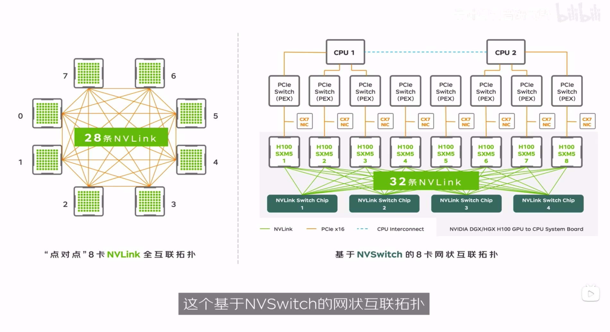

## PCI-e

Peripheral Component Interconnect Express 外部设备快速互联总线

NVIDIA GPUDirect Technology, P2P (Peer to Peer) 

GPU点对点直连，数据从一个GPU的显存直接复制到另一个GPU的显存，不需要CPU利用主机内存并使用PCI-e总线中转。适合需要频繁进行GPU之间数据交换的AI深度学习任务。

但随着AI深度学习任务规模的不断扩大，GPU之间数据交换量也大幅度增长，PCI-e总线带宽逐渐成为数据交换的性能瓶颈。

## NVLINK

NVLink 1.0可以达到双向带宽160 GB/s

但全互联NVLink架构的横向扩展能力仍存在问题：1）每个GPU的NVLink通道有限，2）每对GPU之间只有一条数据通路，存在单点故障隐患。

### 区别

SXM适合百亿，千亿级别的大模型训练和大数据分析，这些场景对于GPU之间的互联带宽要求较高。

PCI-e适合工作负载较小的场景，比如深度学习的小模型训练。

每个GPU和每个NVSwitch有一条NVLink通道。

## 来源

[1] [GPU互联革命史】PCIe到NVLink，再到NVSwitch的成长故事——看GPU如何推动AI与高性能计算！](https://www.bilibili.com/video/BV193BBYYEaG)
