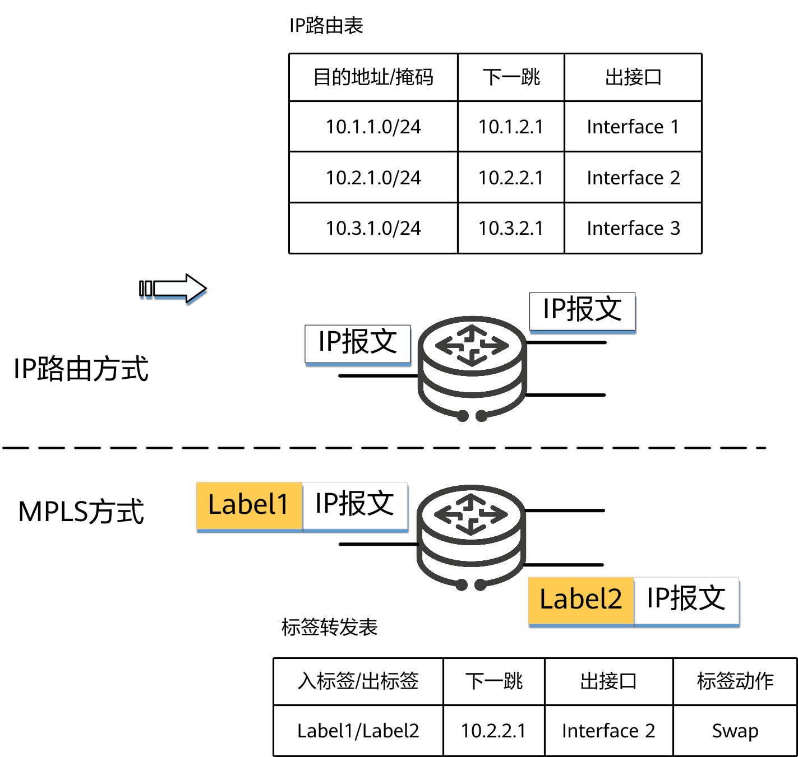
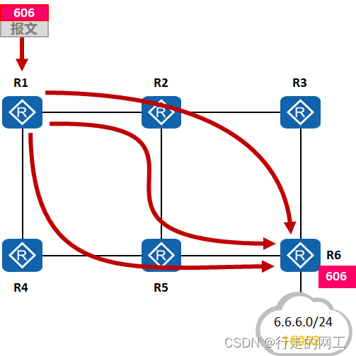
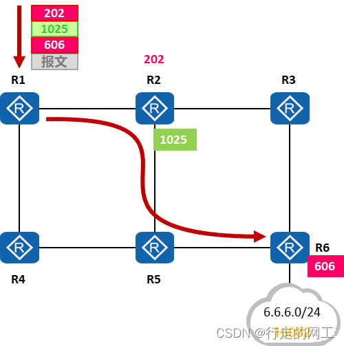

## Segment Routing

## MPLS

MPLS（多协议标签交换，Multi-protocol Label Switching） 是一种用于提高电信网络速度和控制网络流量流向的路由技术。

简单来说，传统的 IP 路由就像是寄信，途经的每一个邮局（路由器）都要仔细查看信封上的收件人完整地址（IP 地址），并在厚厚的地图册（路由表）中查找下一步该往哪送。而 MPLS 就像是给这封信贴上了一个带有条形码的快递标签，后续的转运中心（路由器）只需要扫一下条形码（标签），就能瞬间知道下一个目的地，大大提高了转发效率。**MPLS将IP地址映射为简短且长度固定、只具有本地意义的标签，以标签交换替代IP查表，从而显著提升转发效率。MPLS的标签转发本质上是一种隧道技术，它还支持封装多层标签，并且MPLS天然兼容多种网络层和链路层协议，因此，MPLS非常适合在各种VPN业务中充当公网隧道。**

核心工作原理
* 进入网络（压入标签）：当数据包到达 MPLS 网络的边缘时，边缘路由器会根据数据包的特征（如目的地、服务等级要求等）为其分配一个短小、定长的标签（Label），并将其插入到数据包的头部。

* 网络内转发（交换标签）：数据包在 MPLS 网络内部传输时，核心路由器不再查看复杂的 IP 地址，而是直接读取这个标签。路由器内部有一张非常简单的标签映射表，查表后直接将旧标签替换为新标签（Swap），并迅速转发给下一个节点。

* 离开网络（弹出标签）：当数据包到达网络的另一端边缘，准备离开 MPLS 网络时，边缘路由器会将标签剥离（Pop），恢复其原本的 IP 数据包形态，继续按照传统 IP 路由方式发送给最终用户。

What is MPLS? (The "Post-it Note" Method)

Traditional IP routing requires every router to look deep into a packet to find the destination IP and then check a massive routing table. MPLS simplifies this by using Labels.

* How it works: **When a packet enters an MPLS network, a "Label" (a simple number) is slapped onto it.**

* Forwarding: Intermediate routers (LSRs) don't look at the IP address anymore; they just look at the label, swap it for a new one, and send it out.

* Analogy: Instead of reading the full address on every envelope, a mail sorter just looks at a "Route ID" written on a sticky note.

LDP (Label Distribution Protocol) - 基于IGP算路结果分发标签，LDP协议规定了标签分发过程中的各种消息以及相关的处理进程，主要用于LSR（Label Switched Routers）之间协商会话参数，进行标签分配，进而建立起标签交换路径LSP（Label Switched Paths）。

RSVP-TE - 配置复杂，状态维持困难，消耗资源过多，无法组建大规模网络。

## Segment Routing

核心思想：将网络路径分成一个个段，为网络中的段和转发节点分配ID，Segment ID简称SID。

头节点通过对SID进行有序排列，就可以生成一条转发路径。

分为Node SID, Adjacency SID, Prefix SID

### SR-BE (Best Effort)

使用一个SID来指导设备进行最短路径转发的形式，我们称它为SR-BE（Best Effort）。SR-BE本质是实现传统IGP和LDP的最短路径转发。

### SR-TE (Traffic Engine)

使用多个SID进行组合来指导数据转发，这种工作机制可以对数据的转发路径进行一定约束，从而满足流量工程的需求，因此被称为SR-MPLS TE。

SR-TE有三种组合方式，第一种是使用多个Node SID组合，第二种是使用多个Adjacency SID（邻接SID）进行组合，第三种是Node SID与Adjacency SID两者进行组合。

使用Adjacency SID组成的路径是严格指定的，必须沿着指定的出接口，沿着特定的链路进行转发，这种形式也称为`严格SR-TE`。

使用Node SID组成的路径由于在两个节点之间可能存在等价路由，也可能存在更优路由，他不会指定走哪条路径，只会通过更优的路径到达下一个节点，这种形式也被称为`松散形式的SR-TE`。

## 来源

[1] https://blog.csdn.net/weixin_38788907/article/details/112954358

[2] https://blog.csdn.net/2301_81259159/article/details/136468151

[3] https://info.support.huawei.com/info-finder/encyclopedia/zh/MPLS.html